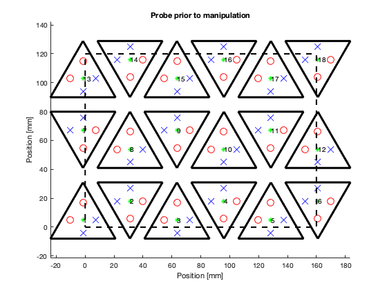

# MOCA
Modular Optode Configuration Analyzer


MOCA is a matlab-based workflow to design new and analyze existing fNIRS modules and their associated probes. It provides researchers with a command-line-based approach to define modules, contains functions to assist in tessellating modules over a region of interest, and produces quantitative metrics of the final probe to interative improvements or to compare probes composed of vastly different modules designs and layouts. 


# Example Usage
## Design Parameters (Inputs)
Defining the module and regions of interest
```
probe.module = createModule(4, 35); % nsides, mdimension
probe.roi = createROI(160,120); % width and height
probe.module.srcposns = [-12.5,12.5; 12.5,-12.5];
probe.module.detposns = [-12.5,4; -4,12.5; 12.5,4];
probe.sdrange = 45;
```


## Assembly Processes (Probe manipulation)

### Automated tessellation process
We can then use automated processes (```createLayout()```) to tessellate the elementary shape over the ROI
```
probe.spacing = 10; 
probe = createLayout(probe); 
figure; plotProbe(probe); plotROI(probe)
```
The resulting probe


### Detailed control over layout
MOCA provides functions to alter layouts to fit real-word constricted designs. 

* Toggle individual modules on and off
``` probe = toggleModules(probe, [2 8], 'off'); ```

* Translate the entire probe relative to ROI
```
probe = translateProbe(probe, [20 40]);
probe = translateProbe(probe, 'center');
```

* Rotate individual modules
``` probe = rotateModules(probe, [1 6], -15); ```

* Translate individual modules
``` probe = translateModules(probe, [9:12], [0 30]); ```

The resulting probe
```figure; plotProbe(probe); plotROI(probe); ```


## Outputs - Probe Characterizations
The final layout of the probe can then be characterized by running ``` probe = characterizeProbe(probe); ```. Results are saved within the probe structure and can be viewed by typing ```probe.results```

```
>> probe.results

ans = 

  struct with fields:

              modulecount: 10
              optodecount: [1×1 struct]
                     full: [1×1 struct]
                 channels: [108×5 double]
            intrachannels: [60×5 double]
            interchannels: [48×5 double]
               sschannels: [20×5 double]
               lschannels: [88×5 double]
               exchannels: [492×5 double]
         brainsensitivity: [88×5 double]
    intrabrainsensitivity: [40×5 double]
    interbrainsensitivity: [48×5 double]
                groupings: [20×5 double]
```
However, it is much easier to visually inspect the outputs using the built-in functions below

### Channel distribution
``` figure; plotChannels(probe, 'hist', 'sd'); ```


### Brain Sensitivity
We can then view the spatial brain sensitivity plots overlaid onto the probe. We can view them for all channels, or only view intra or inter module channels only
```
figure; 
plotProbe(probe); plotROI(probe); plotBrainSensitivity(probe);
title('All Channel Brain Sensitivity')
figure; 
plotProbe(probe); plotROI(probe); plotBrainSensitivity(probe, 'inter');
title('Inter Channel Brain Sensitivity')
figure; 
plotProbe(probe); plotROI(probe); plotBrainSensitivity(probe, 'intra');
title('Intra Channel Brain Sensitivity')
```
Resulting probes, respectively

  


### Spatial Multiplexing Groups
Here, we calculate the total number of groups, and plot spatial multiplexing group number 2 over the probe
```
ngroups = size(unique(probe.results.groupings(:,5)), 1)
figure; plotProbe(probe); plotROI(probe); plotSpatialMultiplexingGroups(probe, [2]);
```


We can also generate a gif of all the groups


## Expandable architecture
Easily extend any process to include any module shape. We can define a new shape and new optode layout to easily create new probes. 

```
% Hexagon probe
probe.module = createModule(6, 25);
probe.module.srcposns = [0,12; -12,0];
probe.module.detposns = [0,-12; 12,0];

%% Triangle Probe
probe.module = createModule(3, 45);
probe.module.srcposns = [0,12; -9,0];
probe.module.detposns = [0,-9; 9,0];
```

The resulting probes

 


# Structure details
Run ```help moca``` to see structure details

```
moca - Modular Optode Configuration Analyzer
              Morris Vanegas <vanegas.m at northeastern.edu>
                  URL: https://github.com/cotilab/moca
  
  Format:
      probe=characterizeProbe(probe);
      
  Workflow:
      https://github.com/COTILab/MOCA/blob/master/images/flowchart.png
  
  Structure:
      probe: a struct. Each element of probe defines the design parameters in
              the workflow above. At least the first two design parameters 
              (probe.module and probe.roi) must be defined. Results from the 
              characterization are saved under probe.results
              
      probe may contain the following fields
      
  Inputs:    
      **probe.module:     A struct with sub-fields:
              probe.module.perimeter: a Px2 double matrix specifying the X,Y 
                          coordinates of the perimeter of the module shape in mm.
                          Modules should be centered at [x,y]=[0,0]
              probe.module.shape:     (optional) a string specifying the 
                          module shape. Can be 'square', 'triangle', or 'hexagon'
              probe.module.dimension: (optional) integer specifying the 
                          length of one side of a regular polygon in mm.
              NOTE: optional subfields are only necessary when using the 
                          automated moca function createModule().
      **probe.roi:        a Px2 double matrix specifying the X,Y coordinates of 
                          the perimeter of the region of interest in mm.
       *probe.module.srcposns:a Nx2 double matrix specifying the X,Y
                          coordinates of each source within a single module in mm
       *probe.module.detposns:a Nx2 double matrix specifying the X,Y
                          coordinates of each detector within a single module in mm
       *probe.sdrange:    an array specifying the minimum and maximum SD
                          separation in mm. Defined as [minSD, maxSD]. minSD is used to 
                          define short-separation channels. If only one
                          value is defined, it is treated at the maxSD.
                          Values are in mm. The default threshold for
                          short-separation channels is 10. 
        probe.spacing:    an integer value specifying the spacing between
                          modules when tessellated over a ROI in mm. Spacing 
                          is done in both X and Y axes. If not defined, 
                          defaults to 0.
        
        fields with ** are required; fields with * are required to reveal 
        more probe characterizations (see workflow). 
        
  Assembly Fields:
      The following fields are derived from createLayout(). These fields 
      emerge when an elementary module is tessellated over a ROI
      
      probe.maxroiwidth:  An integer specifying the maximum width (x axis) 
                          of the ROI in mm
      probe.maxroiheight: An integer specifying the maximum height (y axis) 
                          of the ROI in mm
      probe.n_modules_x:  The number of modules in the x axis if the ROI were
                          a rectangular area
      probe.n_modules_y:  The number of modules in the y axis if the ROI were
                          a rectangular area
      probe.modules:      A Mx2 matrix defining each module's X,Y centroid (in mm), 
                          its orientation angle (in deg), and its active 
                          state (0 or 1). Each row is [centroidX, centroidY,
                          orientationAngle, activeState]. M is the number of 
                          modules in the probe.
      probe.srcposns:     A Sx2 matrix defining the coordinates of a source (in mm), 
                          the module id it is on, and the source id value. S
                          is the number of total sources (number of sources 
                          within a module * number of modules). Each row
                          is [X, Y, moduleID, sourceID]. ModuleID is the row
                          number of probe.modules. Coordinates are defined from
                          a global 0,0 coordinate. Included regardless if module is
                          active or not.
      probe.detposns:     A Dx2 matrix similar to probe.srcposns. Each row
                          is [X, Y, moduleID, detectorID].
      
  Outputs:
      The following fields are derived from characterizeProbe(). The number 
      of outputs depends on the number of design parameters defined. 
      
      probe.results:      A struct with sub-fields:
          results.modulecount:    An integer. The number of active modules in the probe
          results.optodecount:    A struct with sub-fields
                  srcs: An integer with the total number of sources on active modules
                  dets: An integer with the total number of detectors on active modules
                  optodes: An integer with the total number of optodes (srcs + dets)
          results.channels: A Cx5 matrix specifying channels. C is the number of 
                          channels of the probe. Channels is limited to 
                          SD separations below sdrange(2). Each row is
                          [SDseparation, sourceID, detectorID, moduleIDofSource,
                          moduleIDofdetector].
          results.intrachannels: Subset of results.channels that only includes 
                          channels with sources and detectors on the 
                          same module. 
          results.interchannels: Subset of results.channels that only includes 
                          channels with sources and detectors on different
                          modules.
          results.full:   A struct with sub-fields channels, intrachannels, and
                          interchannels. These fields are NOT limited by sdrange.
          results.sschannels: Subset of results.channels with SD separations below
                          sdrange(1), exclusive
          results.lschannels: Subset of results.channels with SD separations between
                          sdrange(1) and sdrange(2), inclusive
          results.exchannels: Channels with SD separations above sdrange(2), 
                          exclusive. 
          results.brainsensitivity: A Bx5 matrix specifying the Brain Sensitivity
                          of each channel. B is the number of channels.
                          Brain Sensitivity is sum of white and gray
                          matter. Each row is [BrainSensitivity, 
                          sourceID, detectorID, moduleIDofSource,
                          moduleIDofdetector].
          results.intrabrainsensitivity: A subset of results.brainsensitivity
                          that only includes channels with sources
                          and detectors on the same module.
          results.interbrainsensitivity: A subset of results.brainsensitivity
                          that only includes channels with sources
                          and detectors on different modules.
          results.groupings:  A Gx5 matrix specifying the spatial multiplexing
                          groups of the probe. Each row is an active
                          source. Each row is defined as [sourceX, 
                          sourceY, moduleID, sourceID,
                          SpatialMultiplexingGroupID]
```
